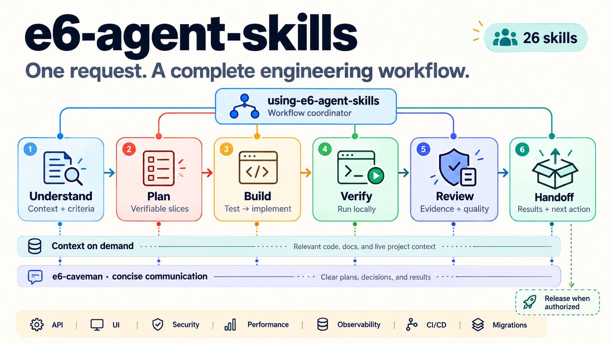

# e6-agent-skills

**Production-grade engineering skills for AI coding agents.**

26 skills guide AI agents from feature context and acceptance criteria through implementation, tests, local runtime checks, review, and handoff. One coordinator loads specialists as needed; `e6-caveman` keeps communication concise.



**Workflow:** Understand → Plan → Build → Verify → Review → Handoff.

Implementation requests continue through the applicable phases within existing authorization. Plan-only, review-only, and test-only requests keep their scope. Commits and releases follow user authorization and project rules. See the [workflow contract](references/workflow-contract.md).

---

## Commands

Nine lifecycle command wrappers are provided for Claude Code and Gemini CLI. Other hosts expose the underlying skills or need their own aliases; Antigravity wrapper availability depends on its version. The table shows short names; Claude plugin commands use a namespace such as `/e6-agent-skills:build`. Gemini names its planning wrapper `/planning`. See the setup guides below.

| What you're doing | Command | Key principle |
|-------------------|---------|---------------|
| Define what to build | `/spec` | Spec before code |
| Plan how to build it | `/plan` | Small, verifiable vertical slices |
| Build incrementally | `/build` or `/build auto` | Next task or whole requested plan |
| Prove it works | `/test` | Meaningful tests and runtime evidence |
| Set the quality bar | `/constraints` | Prove that exceeded thresholds fail |
| Review before merge | `/review` | Improve code health |
| Audit web performance | `/webperf` | Measure before you optimize |
| Simplify the code | `/code-simplify` | Clarity over cleverness |
| Prepare or perform a release | `/ship` | Verified candidate, recovery, and authorization |

Want the whole workflow from one request? Install the complete pack and [activate the coordinator](docs/workflow-activation.md). `using-e6-agent-skills` gathers context, defines criteria, plans, builds with tests, runs locally, reviews, and hands off. `/build auto` completes the whole requested plan using existing authorization; commits and releases follow project rules and user scope.

See the [SDLC workflow change report](docs/sdlc-workflow-report.md) for the audit, implemented improvements, and verification limits.

The Claude plugin registers a compact startup bootstrap. Other hosts can use the idempotent project-rule installer. Native skill selection remains available; activation and model compliance need behavioral verification.

---

## Quick Start

**Complete workflow:** use a native whole-repository plugin below, or keep a complete clone and add a compact project bootstrap. This preserves the coordinator, specialists, shared references, and helper scripts.

```bash
git clone https://github.com/Emikael/e6-agent-skills.git e6-agent-skills

# Preview project wiring; use codex, opencode, gemini, or claude for --host.
node e6-agent-skills/scripts/install-workflow-bootstrap.js \
  --project /path/to/project --pack ./e6-agent-skills --host codex

# Write the bootstrap while preserving existing project instructions.
node e6-agent-skills/scripts/install-workflow-bootstrap.js \
  --project /path/to/project --pack ./e6-agent-skills --host codex --write
```

Node.js is required for the installer and repository checks. The Claude startup hook uses Bash. See the [activation guide](docs/workflow-activation.md) for host-specific wiring and upgrade checks.

**Skill-only installation:** the open [skills CLI](https://github.com/vercel-labs/skills) supports Claude Code, Cursor, Codex, Copilot, and other agents:

```bash
npx skills add Emikael/e6-agent-skills            # choose skills to install
npx skills add Emikael/e6-agent-skills --skill '*' # select all 26 skills
npx skills add Emikael/e6-agent-skills --list     # browse before installing
```

Or grab individual skills:

```bash
npx skills add Emikael/e6-agent-skills --skill e6-code-review-and-quality   # five-axis review before merge
npx skills add Emikael/e6-agent-skills --skill e6-interview-me              # requirements interrogation, one question at a time
npx skills add Emikael/e6-agent-skills --skill e6-test-driven-development   # behavioral red-green-refactor
```

> **Skill discovery and workflow activation are separate.** A skill-only install
> may omit repository-level references, scripts, hooks, and command wrappers,
> even when every skill is selected. For the complete workflow, retain the full
> pack and point the bootstrap at its root. Relative links need the original
> directory layout; copying a shared checklist into an individual skill does
> not repair those links. See [activation](docs/workflow-activation.md) and the
> [portability notes](docs/skill-anatomy.md).

Prefer a native integration? Pick your tool below.

<details>
<summary><b>Claude Code (recommended)</b></summary>

**Marketplace install:**

```
/plugin marketplace add Emikael/e6-agent-skills
/plugin install e6-agent-skills@e6-agent-skills
```

Enable the plugin and start a new session to load its compact SessionStart bootstrap.

> **SSH errors?** The marketplace clones repos via SSH. If you don't have SSH keys set up on GitHub, either [add your SSH key](https://docs.github.com/en/authentication/connecting-to-github-with-ssh/adding-a-new-ssh-key-to-your-github-account) or use the full HTTPS URL to force HTTPS cloning during the marketplace-add step:
> ```bash
> /plugin marketplace add https://github.com/Emikael/e6-agent-skills.git
> /plugin install e6-agent-skills@e6-agent-skills
> ```
>
> If `/plugin install` still fails with `git@github.com: Permission denied (publickey)` on Windows or macOS, the recommended workaround is to configure Git once to rewrite GitHub SSH URLs to HTTPS for subprocess clones:
> ```bash
> git config --global url."https://github.com/".insteadOf git@github.com:
> ```

**Local / development:**

```bash
git clone https://github.com/Emikael/e6-agent-skills.git e6-agent-skills
claude --plugin-dir ./e6-agent-skills
```

</details>

<details>
<summary><b>Cursor</b></summary>

Put discovered skills under `.cursor/skills/` and a compact coordinator policy in `.cursor/rules/*.mdc`. Keep the complete pack accessible for shared references and helpers. See [docs/cursor-setup.md](docs/cursor-setup.md).

</details>

<details>
<summary><b>Antigravity CLI</b></summary>

Install as a native plugin for skills and subagents. In affected Antigravity CLI releases, legacy command TOMLs are reported as converted but their wrapper commands are not discoverable; invoke the underlying namespaced skills directly. See [docs/antigravity-setup.md](docs/antigravity-setup.md#lifecycle-workflows-and-command-compatibility).

**Install from the repo:**

```bash
agy plugin install https://github.com/Emikael/e6-agent-skills.git
```

**Install from a local clone:**

```bash
git clone https://github.com/Emikael/e6-agent-skills.git e6-agent-skills
agy plugin install ./e6-agent-skills
```

</details>

<details>
<summary><b>Gemini CLI</b></summary>

Install native skills for discovery and add a compact workflow bootstrap to `GEMINI.md`. Keep full skill bodies on demand. See [docs/gemini-cli-setup.md](docs/gemini-cli-setup.md).

**Install from the repo:**

```bash
gemini skills install https://github.com/Emikael/e6-agent-skills.git --path skills
```

**Install from a local clone:**

```bash
gemini skills install ./e6-agent-skills/skills/
```

</details>

<details>
<summary><b>Windsurf</b></summary>

Add a compact coordinator rule pointing to the complete pack. Load skill bodies only as needed. See [docs/windsurf-setup.md](docs/windsurf-setup.md).

</details>

<details>
<summary><b>OpenCode</b></summary>

Copy skills to `.opencode/skills/` (or `~/.config/opencode/skills/`), add a project-local `AGENTS.md`, and use the built-in `skill` tool for agent-driven execution. Optional slash commands can be added under `.opencode/commands/`.

See [docs/opencode-setup.md](docs/opencode-setup.md).

</details>

<details>
<summary><b>GitHub Copilot</b></summary>

Install skills under `.github/skills/` and keep compact project policies in `.github/copilot-instructions.md`. Adapt persona filenames to `*.agent.md` under `.github/agents/`. See [docs/copilot-setup.md](docs/copilot-setup.md).

Using the standalone `copilot` CLI? Install it as a plugin — see [docs/copilot-cli-setup.md](docs/copilot-cli-setup.md).

</details>

<details>
  <summary><b>Kiro IDE & CLI </b></summary>
  Skills for Kiro reside under `.kiro/skills/` at project or global scope. Use the host's supported project rules for the compact bootstrap. See the [Kiro skills documentation](https://kiro.dev/docs/skills/).
</details>

<details>
<summary><b>Codex</b></summary>

Install with a Codex CLI that supports `codex plugin`:

```bash
codex plugin marketplace add Emikael/e6-agent-skills
codex plugin add e6-agent-skills@e6-agent-skills
```

The first command registers the marketplace; the second installs the plugin. Codex reads the root `skills/` directory through `.codex-plugin/plugin.json`. Start a new session and select a skill from the host's picker. In the CLI, explicit skill mentions use `$`; plugin skills are namespaced, for example `$e6-agent-skills:using-e6-agent-skills`. Add the compact project bootstrap for whole-workflow requests. See [docs/codex-setup.md](docs/codex-setup.md).

</details>

<details>
<summary><b>Command Code</b></summary>

Install natively with the built-in `cmd skills` command. Command Code clones the repo, discovers every `SKILL.md`, and installs into `.commandcode/skills/`:

```bash
cmd skills add Emikael/e6-agent-skills            # pick skills to install (project)
cmd skills add Emikael/e6-agent-skills --global   # install for all projects (~/.commandcode/skills/)
cmd skills add Emikael/e6-agent-skills -s e6-spec-driven-development  # install a specific skill
```

Installed skills show up in the TUI slash menu, e.g. `/e6-spec-driven-development`. See [docs/commandcode-setup.md](docs/commandcode-setup.md).

</details>

<details>
<summary><b>Other Agents</b></summary>

Skills are plain Markdown - they work with any agent that accepts system prompts or instruction files. See [docs/getting-started.md](docs/getting-started.md).

</details>


---

## Adoption

Already installed? How you roll the pack out depends on your codebase. The **[Adoption Guide](docs/adoption-guide.md)** covers two paths: the full lifecycle from day one for a greenfield project, or an incremental, verification-first rollout for an established codebase.

---

## All 26 Skills

The commands above are entry points. The pack includes 26 skills total — 24 lifecycle skills, the `using-e6-agent-skills` coordinator, and `e6-caveman` for concise communication. Each skill is a structured workflow with steps, verification gates, and anti-rationalization tables. You can also reference any skill directly.

### Coordination and Communication

| Skill | What It Does | Use When |
|-------|-------------|----------|
| [using-e6-agent-skills](skills/using-e6-agent-skills/SKILL.md) | Coordinates the applicable lifecycle through verified handoff | Starting engineering work or choosing the workflow |
| [e6-caveman](skills/e6-caveman/SKILL.md) | Concise prose and bounded delegation while preserving exact evidence | Progress, findings, task packets, and handoffs |

### Understand - Clarify what to build

| Skill | What It Does | Use When |
|-------|-------------|----------|
| [e6-interview-me](skills/e6-interview-me/SKILL.md) | Read settled context, then ask about material gaps in outcome, actors, success, and scope | The ask is underspecified, or the user invokes "interview me" / "grill me" |
| [e6-idea-refine](skills/e6-idea-refine/SKILL.md) | Structured divergent/convergent thinking to turn vague ideas into concrete proposals | You have a rough concept that needs exploration |
| [e6-spec-driven-development](skills/e6-spec-driven-development/SKILL.md) | Record observable requirements, scope, and proof methods before changing behavior | Starting a new project, feature, or significant change |
| [e6-constraint-driven-development](skills/e6-constraint-driven-development/SKILL.md) | Reuse or define CONSTRAINTS.md, prove gate failures, and detect weakened checks | Quality standards or enforcement are missing or disputed |

### Plan - Break it down

| Skill | What It Does | Use When |
|-------|-------------|----------|
| [e6-planning-and-task-breakdown](skills/e6-planning-and-task-breakdown/SKILL.md) | Decompose specs into small, verifiable tasks with acceptance criteria and dependency ordering | You have a spec and need implementable units |

### Build - Write the code

| Skill | What It Does | Use When |
|-------|-------------|----------|
| [e6-incremental-implementation](skills/e6-incremental-implementation/SKILL.md) | Build verifiable vertical slices with behavior tests or characterization, local runtime, and review | Implementing a feature in multiple increments |
| [e6-test-driven-development](skills/e6-test-driven-development/SKILL.md) | Red-Green-Refactor, risk-based test levels, test sizes, DAMP over DRY, Beyonce Rule, browser testing | Implementing logic, fixing bugs, or changing behavior |
| [e6-context-engineering](skills/e6-context-engineering/SKILL.md) | Trace relevant code, tests, commands, and decisions; bound worker context and preserve resume state | Starting a session, switching tasks, delegating, or recovering stale context |
| [e6-source-driven-development](skills/e6-source-driven-development/SKILL.md) | Verify version-sensitive decisions against authoritative sources, tests, and local runtime | You want authoritative, source-cited code for a framework or library |
| [e6-doubt-driven-development](skills/e6-doubt-driven-development/SKILL.md) | Scoped fresh-context review of material uncertainty, with optional authorized cross-model escalation | Stakes are high, code is unfamiliar, or a decision needs independent evidence |
| [e6-frontend-ui-engineering](skills/e6-frontend-ui-engineering/SKILL.md) | Build coherent components and states; verify responsive, keyboard, focus, and accessible behavior in the app | Building or modifying user-facing interfaces |
| [e6-api-and-interface-design](skills/e6-api-and-interface-design/SKILL.md) | Contract-first design, Hyrum's Law, One-Version Rule, error semantics, boundary validation | Designing APIs, module boundaries, or public interfaces |

### Verify - Prove it works

| Skill | What It Does | Use When |
|-------|-------------|----------|
| [e6-browser-testing-with-devtools](skills/e6-browser-testing-with-devtools/SKILL.md) | Available browser/computer or existing automation for real local interaction, DOM, console/network, and runtime evidence | Building or debugging anything that runs in a browser |
| [e6-debugging-and-error-recovery](skills/e6-debugging-and-error-recovery/SKILL.md) | Reproduce, diagnose, observe a failing regression test, fix, and recheck the original runtime path | Tests fail, builds break, or behavior is unexpected |

### Review - Quality gates before merge

| Skill | What It Does | Use When |
|-------|-------------|----------|
| [e6-code-review-and-quality](skills/e6-code-review-and-quality/SKILL.md) | Review contracts, callers, diff, and evidence; report located findings as Critical/Required/Optional/Nit/Consider/FYI | Reviewing a change or checking implementation before handoff |
| [e6-code-simplification](skills/e6-code-simplification/SKILL.md) | Establish a baseline and reduce complexity while preserving outputs, errors, ordering, and side effects | Code works but is harder to read or maintain than it should be |
| [e6-security-and-hardening](skills/e6-security-and-hardening/SKILL.md) | Threat-model boundaries, test allowed and denied cases, and verify auth, data, secrets, and dependency controls | Handling user input, auth, data storage, or external integrations |
| [e6-performance-optimization](skills/e6-performance-optimization/SKILL.md) | Measure representative baselines against project budgets and preserve semantic correctness | Performance requirements exist or you suspect regressions |

### Handoff and Release - Finish and prepare delivery

| Skill | What It Does | Use When |
|-------|-------------|----------|
| [e6-git-workflow-and-versioning](skills/e6-git-workflow-and-versioning/SKILL.md) | Preserve dirty work, prepare verified atomic commits, resolve conflicts, and bind releases to tested revisions | Authorized commits, PRs, history changes, or versioned releases |
| [e6-ci-cd-and-automation](skills/e6-ci-cd-and-automation/SKILL.md) | Verify required gates, secretless PR checks, trusted deploys, and artifact identity | Setting up or modifying build and deploy pipelines |
| [e6-deprecation-and-migration](skills/e6-deprecation-and-migration/SKILL.md) | Migrate consumers safely with compatibility tests, resumable backfills, and proven recovery | Removing old systems, migrating users, or sunsetting features |
| [e6-documentation-and-adrs](skills/e6-documentation-and-adrs/SKILL.md) | Architecture Decision Records, API docs, inline documentation standards - document the *why* | Making architectural decisions, changing APIs, or shipping features |
| [e6-observability-and-instrumentation](skills/e6-observability-and-instrumentation/SKILL.md) | Reuse the telemetry stack; verify bounded logs, metrics, traces, redaction, and alert delivery | Adding telemetry or changing a critical production path |
| [e6-shipping-and-launch](skills/e6-shipping-and-launch/SKILL.md) | Assess GO/NO-GO/HOLD using candidate evidence, recovery, rollout thresholds, and authorization | Preparing or performing a production release |

---

## Agent Personas

Pre-configured specialist personas for targeted reviews:

| Agent | Role | Perspective |
|-------|------|-------------|
| [code-reviewer](agents/code-reviewer.md) | Senior Staff Engineer | Five-axis code review with "would a staff engineer approve this?" standard |
| [test-engineer](agents/test-engineer.md) | QA Specialist | Test strategy, coverage analysis, and the Prove-It pattern |
| [security-auditor](agents/security-auditor.md) | Security Engineer | Vulnerability detection, threat modeling, OWASP assessment |
| [web-performance-auditor](agents/web-performance-auditor.md) | Web Performance Engineer | Core Web Vitals audit with Quick/Deep modes and a metric-honesty rule; run it via `/webperf` |

See [docs/agents.md](docs/agents.md) for the decision matrix, orchestration rules, and how personas compose with skills and slash commands.

---

## Shared Workflow References

Quick-reference material that skills pull in when needed:

| Reference | Covers |
|-----------|--------|
| [workflow-bootstrap.md](references/workflow-bootstrap.md) | Compact host/project policy selecting the coordinator and concise communication |
| [workflow-contract.md](references/workflow-contract.md) | Phase gates, scope, acceptance tests, runtime/computer checks, delegation, and learning |
| [definition-of-done.md](references/definition-of-done.md) | Standing project bar applied alongside each task's acceptance criteria |
| [testing-patterns.md](references/testing-patterns.md) | Test structure, naming, mocking, React/API/E2E examples, anti-patterns (JavaScript/TypeScript) |
| [security-checklist.md](references/security-checklist.md) | Pre-commit checks, auth, input validation, headers, CORS, OWASP Top 10 |
| [performance-checklist.md](references/performance-checklist.md) | Core Web Vitals targets, frontend/backend checklists, measurement commands |
| [accessibility-checklist.md](references/accessibility-checklist.md) | Keyboard nav, screen readers, visual design, ARIA, testing tools |
| [observability-checklist.md](references/observability-checklist.md) | On-call questions, structured logging, RED/USE metrics, tracing, symptom-based alerting, pre-launch gate |
| [orchestration-patterns.md](references/orchestration-patterns.md) | One coordinator, independent bounded workers, sequential fallback, and ownership |

---

## How Skills Work

Every skill follows a consistent anatomy:

```
┌─────────────────────────────────────────────────┐
│  SKILL.md                                       │
│                                                 │
│  ┌─ Frontmatter ─────────────────────────────┐  │
│  │ name: lowercase-hyphen-name               │  │
│  │ description: Use when [trigger].          │  │
│  │              [Concrete task vocabulary.]  │  │
│  └───────────────────────────────────────────┘  │
│  Overview         → What this skill does        │
│  When to Use      → Triggering conditions       │
│  Process          → Step-by-step workflow       │
│  Rationalizations → Excuses + rebuttals         │
│  Red Flags        → Signs something's wrong     │
│  Verification     → Evidence requirements       │
└─────────────────────────────────────────────────┘
```

**Key design choices:**

- **Explicit handoffs.** Specialists return evidence to one coordinator, which continues the requested workflow.
- **Anti-rationalization.** Every skill includes a table of common excuses agents use to skip steps (e.g., "I'll add tests later") with documented counter-arguments.
- **Evidence before completion.** Changed behavior needs observed RED/GREEN; refactors use characterization; prose/configuration uses relevant validators. Required unavailable checks remain blocked.
- **Actual local behavior.** Run the affected endpoint, CLI, integration, or UI flow; use available browser/computer capabilities when needed.
- **Progressive disclosure.** Load the current skill and needed references. Workers get bounded criteria and source pointers, with a 500-word input and 200-word return target.

---

## Validation and Evals

The repository checks structure, command parity, links, and lexical routing without model calls:

```bash
node scripts/validate-skills.js
node scripts/validate-reference-links.js
node scripts/validate-commands.js
node scripts/run-evals.js --min-rank1 95
```

There are 65 behavioral scenarios across 26 skill case files, with runnable fixtures and optional Claude/Codex execution. Lexical ranking tests vocabulary within this catalog; it does not prove natural model activation or priority against another plugin. Behavioral dry-runs validate inputs without running a model. Actual model traces, tests, and runtime artifacts establish compliance. See the [eval guide](evals/README.md) and [change report](docs/sdlc-workflow-report.md).

---

## Project Structure

The portable core stays in shared directories. Host-specific paths are native discovery conventions, not branding aliases; renaming or merging them would break the tools that scan those exact locations.

| Layer / consumer | Repository paths | Purpose |
|---|---|---|
| Shared workflow core | `skills/` (26 skills) | Portable `SKILL.md` workflows used by every integration |
| Shared review material | `agents/` (4 personas), `references/` (9 documents) | Specialist reviewers, workflow contracts, and pack-level checklists |
| Claude Code adapter | `.claude/commands/` (9 commands), `.claude-plugin/`, `hooks/` | Slash-command wrappers, marketplace metadata, and lifecycle hooks |
| Gemini CLI adapter | `.gemini/commands/` (9 commands) | Gemini-native TOML command wrappers |
| Antigravity CLI adapter | `commands/` (9 commands), `plugin.json` | Legacy TOML wrappers and the root plugin manifest; see the [known wrapper limitation](docs/antigravity-setup.md#lifecycle-workflows-and-command-compatibility) |
| Codex adapter | `.codex-plugin/`, `.agents/plugins/` | Codex plugin metadata and marketplace registration; Codex consumes `skills/` directly |
| GitHub Copilot CLI adapter | `plugin.json` | Root plugin metadata; Copilot CLI discovers `skills/` by convention and does not register the lifecycle wrappers |
| Contributor tooling | `scripts/`, `evals/` (26 case files), `.github/workflows/` | Validation, installation, routing evals, and CI |
| Documentation | `docs/` | Universal guidance and per-tool setup guides |

Tools without a checked-in adapter directory install or copy the shared `skills/` core into their own native location. The [Quick Start](#quick-start) links the setup guide for each supported host.

---

## Why e6-agent-skills?

AI coding agents can skip specs, tests, security reviews, and the practices that make software reliable. e6-agent-skills gives agents explicit workflow steps and evidence gates drawn from production engineering practice. Host wiring improves activation; actual model compliance still needs evaluation.

Each skill encodes hard-won engineering judgment: *when* to write a spec, *what* to test, *how* to review, and *when* to ship. These aren't generic prompts - they're the kind of opinionated, process-driven workflows that separate production-quality work from prototype-quality work.

Skills bake in best practices from Google's engineering culture — including concepts from [Software Engineering at Google](https://abseil.io/resources/swe-book) and Google's [engineering practices guide](https://google.github.io/eng-practices/). You'll find Hyrum's Law in API design, the Beyonce Rule and test pyramid in testing, change sizing and review speed norms in code review, Chesterton's Fence in simplification, trunk-based development in git workflow, Shift Left and feature flags in CI/CD, and a dedicated deprecation skill treating code as a liability. These aren't abstract principles — they're embedded directly into the step-by-step workflows agents follow.

---

## How it compares

See the [workflow design sources](docs/workflow-design-sources.md) for patterns adapted from Compound Engineering, Superpowers, ADHD, and Caveman, with inspected revisions and licenses. The [comparison guide](docs/comparison.md) provides background on other skill packs; its external single-task experiment does not measure these latest changes.

---

## Contributing

Skills should be **specific** (actionable steps, not vague advice), **verifiable** (clear exit criteria with evidence requirements), **battle-tested** (based on real workflows), and **minimal** (only what's needed to guide the agent).

See [docs/skill-anatomy.md](docs/skill-anatomy.md) for the format specification and [CONTRIBUTING.md](CONTRIBUTING.md) for guidelines.

---

## Team

e6-agent-skills is built and maintained by:

| | Name | GitHub | Role |
|---|------|--------|------|
|  | **Addy Osmani** | [@addyosmani](https://github.com/addyosmani) | Creator |
|  | **Federico Bartoli** | [@federicobartoli](https://github.com/federicobartoli) | Collaborator |
|  | **Joan León** | [@nucliweb](https://github.com/nucliweb) | Collaborator |

---

## License

MIT - use these skills in your projects, teams, and tools.
